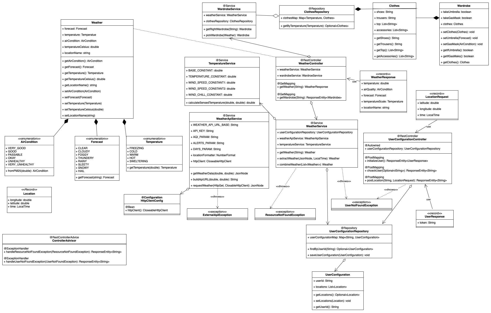

# Weather Application

Welcome to the Weather Application! The Weather Application is a full-stack web application that provides users with real-time weather information based on their input. The project is structured into a backend component, developed with Spring Boot and Gradle, and a frontend component built with React.

## Requirements
- [Node.js](https://nodejs.org/en) installed
- [Java Development Kit (JDK) ](https://www.oracle.com/java/technologies/downloads/) installed (Java 17 or higher)
- [Git](https://git-scm.com/) installed


## Run Application Locally

To run the application locally, follow these steps:

1. Clone the project

```bash
  git clone https://bitbucket.lab.ii.agh.edu.pl/scm/to2023/kp-wt-1500-chmurki.git
```

2. Go to the project directory

```bash
  cd kp-wt-1500-chmurki
```

3. Run the start script from bash console

```bash
  ./start_application.sh
```

4. To stop application press "Ctrl+C"

## Run Application Locally - alternative way (without bash)


1. Clone the project

```bash
  git clone https://bitbucket.lab.ii.agh.edu.pl/scm/to2023/kp-wt-1500-chmurki.git
```

2. Go to the project directory

```bash
  cd kp-wt-1500-chmurki
```

3. Run Java Application:  `WeatherApplication.java`

    You can find this file in: `src\main\java\pl\edu\agh\to2\example\WeatherApplication.java`

4. Go to the frontend directory

```bash
  cd frontend
```

5. Run following commands

```bash
  npm install
```

```bash
  npm start
```

6. The application is running on `localhost:3000`

## Structure
- [Backend](https://bitbucket.lab.ii.agh.edu.pl/projects/TO2023/repos/kp-wt-1500-chmurki/browse?at=refs%2Fheads%2FM1) - The backend component is responsible for interacting with the [Weather API](https://www.weatherapi.com/) to fetch weather data.
- [Frontend](https://bitbucket.lab.ii.agh.edu.pl/projects/TO2023/repos/kp-wt-1500-chmurki/browse/frontend?at=refs%2Fheads%2FM1) - The frontend component manages user input and displays weather information in a user-friendly way.

## UML Schema




## Authors

- Aleksandra Poskróbek
- Karolina Kucia
- Antoni Wójcik
- Grzegorz Piśkorski
